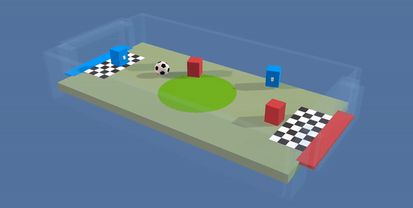

# The Arena: An Evaluation Platform for General Self-play.

## Requirements

In order to install requirements, follow:

```bash
# For users behind the Great Wall
conda config --add channels https://mirrors.tuna.tsinghua.edu.cn/anaconda/pkgs/free/
conda config --add channels https://mirrors.tuna.tsinghua.edu.cn/anaconda/pkgs/main/
conda config --set show_channel_urls yes
pip install pip -U
pip config set global.index-url https://pypi.tuna.tsinghua.edu.cn/simple

# Create a virtual environment
conda create -n Arena python=3.6.7 -y
source activate Arena

# PyTorch
pip install --upgrade torch torchvision

# TensorFlow
pip install --upgrade tensorflow

# Baselines for Atari preprocessing
git clone https://github.com/openai/baselines.git
cd baselines
pip install -e .
cd ..

git clone https://github.com/Unity-Technologies/ml-agents.git
cd ml-agents
git checkout d3f9fd63043f1c82790d3fe35ee07dc5ed1232b9
cd ml-agents
pip install -e .
cd ..
cd gym-unity
pip install -e .
cd ..

# Clone code
mkdir Arena
cd Arena
git clone https://github.com/YuhangSong/Arena-2.git
cd Arena-2

# Other requirements
pip install -r requirements.txt
```

If you are running on a remote server without GUI (Xserver) but require a vision input, follow [here](https://github.com/Unity-Technologies/ml-agents/blob/master/docs/Training-on-Amazon-Web-Service.md), section ```Setting up X Server (optional)```.
If you have a Xserver but it does not belongs (started by) your user, you cannot access it.
If you have a Xserver that belongs to (started by) you, it should be fine but I never tested it.
```
# Install Xorg
sudo apt-get update
sudo apt-get install -y xserver-xorg mesa-utils
sudo nvidia-xconfig -a --use-display-device=None --virtual=1280x1024

# Get the BusID information
nvidia-xconfig --query-gpu-info

# Add the BusID information to your /etc/X11/xorg.conf file
sudo sed -i 's/    BoardName      "Tesla K80"/    BoardName      "Tesla K80"\n    BusID          "0:30:0"/g' /etc/X11/xorg.conf

# Remove the Section "Files" from the /etc/X11/xorg.conf file
# And remove two lines that contain Section "Files" and EndSection
sudo vim /etc/X11/xorg.conf

# Download and install the latest Nvidia driver for ubuntu
# Please refer to http://download.nvidia.com/XFree86/Linux-#x86_64/latest.txt
wget http://download.nvidia.com/XFree86/Linux-x86_64/390.87/NVIDIA-Linux-x86_64-390.87.run
sudo /bin/bash ./NVIDIA-Linux-x86_64-390.87.run --accept-license --no-questions --ui=none

# Disable Nouveau as it will clash with the Nvidia driver
sudo echo 'blacklist nouveau'  | sudo tee -a /etc/modprobe.d/blacklist.conf
sudo echo 'options nouveau modeset=0'  | sudo tee -a /etc/modprobe.d/blacklist.conf
sudo echo options nouveau modeset=0 | sudo tee -a /etc/modprobe.d/nouveau-kms.conf
sudo update-initramfs -u

sudo reboot now
```

Create a TMUX session to hold your programe
```
tmux new-session -s Arena
sudo killall Xorg
# or use sudo init 3
sudo /usr/bin/X :0 &
```

Before run any new window in a TMUX session:
```
export DISPLAY=:0
source activate Arena
```

## Run the code

```
CUDA_VISIBLE_DEVICES=0 python main.py --mode eval_population --env-name Fallflat-v2 --trainer ppo --use-gae --lr 2.5e-4 --clip-param 0.1 --value-loss-coef 0.5 --num-processes 32 --num-steps 1024 --num-mini-batch 128 --use-linear-lr-decay --use-linear-clip-decay --entropy-coef 0.01 --num-env-steps 100000000 --sp-switch-component-interval 10 --sp-switch-component-principle uniform --vis --vis-interval 1 --log-interval 1 --num-eval-episodes 5 --eval-interval 100 --save-interval 10 --arena-start-index 13569 --aux 17
```

### Procedures

* ```--mode train```
* ```--mode eval_population```
* ```--mode eval_human```

### Progress Sheet

Game  | Server |  train  |  eval_population | eval_human
:-------------------------:|:-------------------------:|:-------------------------:|:-------------------------:|:-------------------------:
Shooter-v4-Random   | H4n  |  Done     |  Done    | None
Boomer-v2           | H4n  |  Done     |  Done    | None
Billiards-v1        | H4n  |  Done     |  None    | None
Tennis-v1-Random    | W5n  |  Done     |  None    | None
AirHockey-v1        | H4n  |  Done     |  Running | None
Tank_TP-v1          | W5n  |  Running  |  None    | None
Fallflat-v2         | H4n  |  Done     |  Running | None
SoccerOne-v3-Random | None |  None     |  None    | None
Snake-v3-Random     | None |  Done     |  Running | None

## Visualization

The code log multiple curves to help analysis the training process, run:
```
source activate Arena && tensorboard --logdir ../results/ --port 8888
```
and visit ```http://localhost:4253``` for visualization with tensorboard.

If your port is blocked, use natapp to forward a port:
```
./natapp --authtoken 710a6e3d5b6c23a5
```

## Evaluate

To evaluate your agent in our gladiators, run:
```
```

## More details about baselines provided

Baseline self-play we provided:

* ```--sp-switch-component-principle recent``` The most naive baseline, play against recent your self.
* ```--sp-switch-component-principle uniform``` Play against your self in the history, uniformly sampled.

## Common Problems

## Build Games

* Source code of games are located in ```./ArenaEnvProjects/```, every game is a independent unity project.
* Make sure you go to Build Settings > Player Settings and switch "Display Resolution Dialog" to Disabled or Hidden By Default.
* Build the game with right platform (Linux x86), put the binary file in ```./Bin/```. Name it ```<GameName-Platform>```, for example ```Tennis-Linux```.

## Kill Games

```
ps aux | grep -ie Linux.x86_64 | awk '{print "kill -9 " $2}'
```

## License

[Apache License 2.0](LICENSE)

## Citation

If you use Arena to conduct research, we ask that you cite the following paper as a reference:

If you use Unity or the ML-Agents Toolkit to conduct research, we ask that you cite the following paper as a reference:
