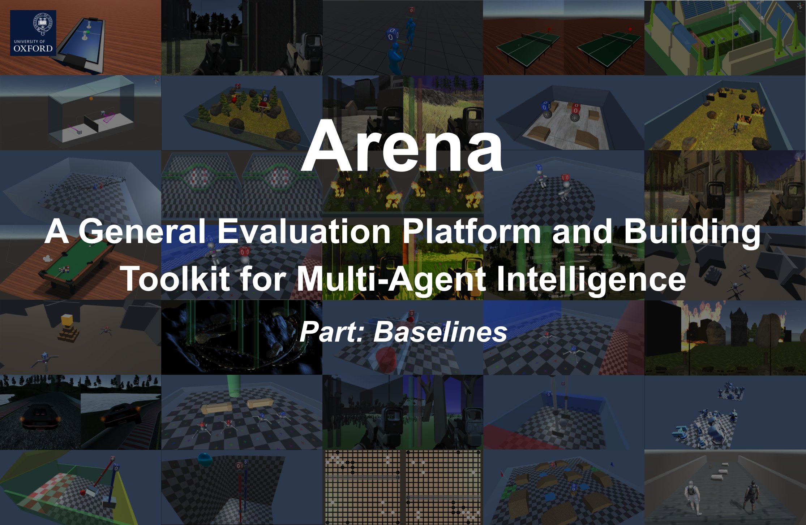
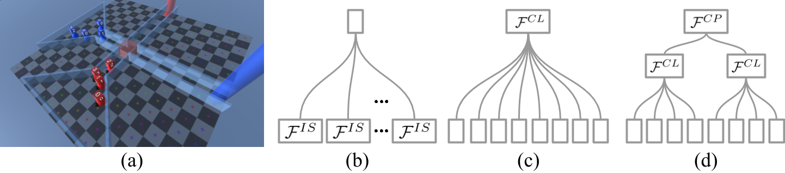

## Introduction

Learning agents that are not only capable of taking tests but are also innovating are becoming a hot topic in artificial intelligence (AI). One of the most promising paths towards this vision is multi-agent learning, where agents act as the environment for each other, and improving each agent means proposing new problems for others. However, the existing evaluation platforms are either not compatible with multi-agent settings, or limited to a specific game. That is, there is not yet a general evaluation platform for research on multi-agent intelligence. To this end, we introduce Arena, a general evaluation platform for multi-agent intelligence with 35 games of diverse logic and representations.
More resources (paper, supplementary, documentation, code of building toolkit) can be found in [Arena Home](https://sites.google.com/view/arena-unity/).



## Status: Beta

We are currently open to any suggestions or pull requests from the community to make Arena a better platform.
Some features mentioned in the paper may not yet available, since we are trying to make the codebase more consistent and just re-structured the project.

## Updates

* RAM observation will be depreciated, since we found using visual+rnn results in much better in both data efficiency and wall-time, even in continuous robot control games. Besides, for RAM observation, it is hard to orginize information from multiple players in one RAM of a fixed size (fixed size is important for extensibility of number of agents, different social paradigms, meta and transfer learning). However, visual observation can maintain a fixed observation shape and size.

## Citation

If you use Arena to conduct research, we ask that you cite the following paper as a reference:
```
@article{song2019arena,
  title={Arena: A General Evaluation Platform and Building Toolkit for Multi-Agent Intelligence},
  author={Song, Yuhang and Wang, Jianyi and Lukasiewicz, Thomas and Xu, Zhenghua and Xu, Mai and Ding, Zihan and Wu, Lianlong},
  journal={arXiv preprint arXiv:1905.08085},
  year={2019}
}
```
as well as the engine behind Arena, without which the platform would be impossible to create
```
@article{juliani2018unity,
  title={Unity: A general platform for intelligent agents},
  author={Juliani, Arthur and Berges, Vincent-Pierre and Vckay, Esh and Gao, Yuan and Henry, Hunter and Mattar, Marwan and Lange, Danny},
  journal={arXiv preprint arXiv:1809.02627},
  year={2018}
}
```

## Requirements

In order to install requirements, follow:

```bash
# For users behind the Great Wall
conda config --add channels https://mirrors.tuna.tsinghua.edu.cn/anaconda/pkgs/free/
conda config --add channels https://mirrors.tuna.tsinghua.edu.cn/anaconda/pkgs/main/
conda config --set show_channel_urls yes
pip install pip -U
pip config set global.index-url https://pypi.tuna.tsinghua.edu.cn/simple

# Create a virtual environment
conda create -n Arena python=3.6.7 -y
source activate Arena

# PyTorch
pip install --upgrade torch torchvision

# TensorFlow
pip install --upgrade tensorflow

# Baselines for Atari preprocessing
git clone https://github.com/openai/baselines.git
cd baselines
pip install -e .
cd ..

# ML-Agents
git clone https://github.com/Unity-Technologies/ml-agents.git
cd ml-agents
cd ml-agents
pip install -e .
cd ..
cd gym-unity
pip install -e .
cd ..
cd ..

# Clone code
mkdir Arena
cd Arena
git clone https://github.com/YuhangSong/Arena-4.git
cd Arena-4

# Other requirements
pip install -r requirements.txt
```

## Setup X-Server

If you run into following situations,

* you are running on a remote server without GUI (X-Server).
* your machine have a X-Server but it does not belongs (started by) your account, so you cannot access it.
* if none of above is your situation, i.e., you are running things on your onw desktop, skip this section.

follow [here](https://github.com/Unity-Technologies/ml-agents/blob/master/docs/Training-on-Amazon-Web-Service.md), section ```Setting up X Server (optional)```, in order to setup a virtual display and virtual X-Server.
Or, follow guidelines below (copied from above link).

* Note that if you have a X-Server belongs to your account, you can just start multiple windows held by a TMUX session when you are on the machine's GUI desktop (in this way, the window has access to X-Server). After that, connect to this machine remotely and attach the session (windows) you started on the GUI desktop.

```
# Install Xorg
sudo apt-get update
sudo apt-get install -y xserver-xorg mesa-utils
sudo nvidia-xconfig -a --use-display-device=None --virtual=1280x1024

# Get the BusID information
nvidia-xconfig --query-gpu-info

# Add the BusID information to your /etc/X11/xorg.conf file
sudo sed -i 's/    BoardName      "GeForce GTX TITAN X"/    BoardName      "GeForce GTX TITAN X"\n    BusID          "0:30:0"/g' /etc/X11/xorg.conf

# Remove the Section "Files" from the /etc/X11/xorg.conf file
# And remove two lines that contain Section "Files" and EndSection
sudo vim /etc/X11/xorg.conf

# Download and install the latest Nvidia driver for ubuntu
# Please refer to http://download.nvidia.com/XFree86/Linux-#x86_64/latest.txt
wget http://download.nvidia.com/XFree86/Linux-x86_64/390.87/NVIDIA-Linux-x86_64-390.87.run
sudo /bin/bash ./NVIDIA-Linux-x86_64-390.87.run --accept-license --no-questions --ui=none

# Disable Nouveau as it will clash with the Nvidia driver
sudo echo 'blacklist nouveau'  | sudo tee -a /etc/modprobe.d/blacklist.conf
sudo echo 'options nouveau modeset=0'  | sudo tee -a /etc/modprobe.d/blacklist.conf
sudo echo options nouveau modeset=0 | sudo tee -a /etc/modprobe.d/nouveau-kms.conf
sudo update-initramfs -u

sudo reboot now
```

Kill Xorg and start vitual display
```
ps aux | grep -ie Xorg | awk '{print "sudo kill -9 " $2}'
# or use sudo killall Xorg
# or use sudo init 3
sudo /usr/bin/X :0 &
```

Before run in a new window:
```
export DISPLAY=:0
```

## Run the code

Crate TMUX session and enter virtual environment
```
tmux new-session -s Arena
source activate Arena
```

### Continuous Action Space

#### Two Players Self-Play

Games:
* ArenaCrawlerMove-2T1P-v1-Continuous
* ArenaCrawlerPush-2T1P-v1-Continuous
* ArenaWalkerMove-2T1P-v1-Continuous
* Crossroads-2T1P-v1-Continuous

Commands, replace <GAME_NAME> with above games:
```
CUDA_VISIBLE_DEVICES=0 python main.py --mode train --env-name <GAME_NAME> --obs-type visual --recurrent-brain --trainer ppo --use-gae --lr 3e-4 --value-loss-coef 0.5 --ppo-epoch 10 --num-processes 16 --num-steps 2048 --num-mini-batch 16 --gamma 0.995 --tau 0.95 --use-linear-lr-decay --entropy-coef 0 --num-env-steps 100000000 --reload-playing-agents-principle prioritized --vis --vis-interval 1 --log-interval 1 --num-eval-episodes 10 --arena-start-index 31969 --aux 17_rb
```

#### Multiple (more than 2) Players Self-Play

Games:
* Crossroads-2T2P-v1-Continuous
* ArenaCrawlerPush-2T2P-v1-Continuous

Commands, replace <GAME_NAME> with above games:
```
CUDA_VISIBLE_DEVICES=0 python main.py --mode train --env-name <GAME_NAME> --obs-type visual --recurrent-brain --trainer ppo --use-gae --lr 3e-4 --value-loss-coef 0.5 --ppo-epoch 10 --num-processes 16 --num-steps 2048 --num-mini-batch 16 --gamma 0.995 --tau 0.95 --use-linear-lr-decay --entropy-coef 0 --num-env-steps 100000000 --reload-playing-agents-principle recent --vis --vis-interval 1 --log-interval 1 --num-eval-episodes 10 --arena-start-index 31969 --aux 17_rb
```

### Discrete Action Space

Games:
* Crossroads-2T1P-v1-Discrete

Commands, replace <GAME_NAME> with above games:
```
CUDA_VISIBLE_DEVICES=0 python main.py --mode train --env-name <GAME_NAME> --obs-type visual --trainer ppo --use-gae --lr 2.5e-4 --clip-param 0.1 --value-loss-coef 0.5 --num-processes 16 --num-steps 1024 --num-mini-batch 128 --use-linear-lr-decay --entropy-coef 0.01 --num-env-steps 100000000 --reload-playing-agents-principle prioritized --vis --vis-interval 1 --log-interval 1 --num-eval-episodes 10 --arena-start-index 33969 --aux 17
```

## Visualization

**Curves:**
The code log multiple curves to help analysis the training process, run:
```
source activate Arena && tensorboard --logdir ../results/ --port 8888
```
and visit ```http://localhost:4253``` for visualization with tensorboard.

If your port is blocked, use natapp to forward a port:
```
./natapp --authtoken ec2f6af6ebe7c405
```

**Behaviors:**
Set ```--mode vis_train```, so that
* The game engine runs at a real time scale of 1 (when training, it runs 100 times as the real time scale).
* The game runs only one thread.
* The game renders at 1920*1080, where you can observe agents' observations as well as the top-down view of the global state.
* All agents act deterministically without exploring.

## Baselines and options

Above example commands runs a self-play with following options and features:

* In different thread, the agent is taking different roles, so that the learning generalize better.
* ```--reload-playing-agents-principle``` has three options
  * ```recent``` players other than the learning agent are loaded with the most recent checkpoint.
  * ```random``` players other than the learning agent are loaded with the a random checkpoint among all historical checkpoints.
  * ```prioritized``` players other than the learning agent are loaded with the a random checkpoint sampled according to the winning rate (only valid for competitive two play games).

## Common Problems

#### Game threads still running

Sometimes, the game threads do not exit properly after you kill the python thread.
Run following command to print a banch of kill commmands.
Then run the printed commands to kill all the game threads.
```
ps aux | grep -ie Linux.x86_64 | awk '{print "kill -9 " $2}'
```

#### Port still in use

It takes some time for the port to release after you killed the python thread.
If you make make sure that your game threads have been killed, you are perfectly fine to run python with a different ```--arena-start-index 33969```.
Or just wait for a while till the system release the port.

#### Copy models

You may find it is useful to copy models from a remote server to your desktop, so that you can see training visualization of the game.
For example,

* The experiment you want to copy is: ```/home/yuhangsong/Arena/results/en-Crossroads-2T1P-v1-Discrete-visual/ti-ppo/sscp-prioritized/a-17```
* The most recent agent id is: ```43139072```
* You are copying from a remote server: ```-P 30007 yuhangsong@fbafc1ae575e5123.natapp.cc```

You can run following commands to copy necessary checkpoints:

```
mkdir -p /home/yuhangsong/Arena/results/en-Crossroads-2T1P-v1-Discrete-visual/ti-ppo/sscp-prioritized/a-17/
scp -r -P 30007 yuhangsong@fbafc1ae575e5123.natapp.cc:/home/yuhangsong/Arena/results/en-Crossroads-2T1P-v1-Discrete-visual/ti-ppo/sscp-prioritized/a-17/\{agent_43139072.pt,eval,checkpoints_reward_record.npy,update_i.npy,event*\} /home/yuhangsong/Arena/results/en-Crossroads-2T1P-v1-Discrete-visual/ti-ppo/sscp-prioritized/a-17/
```

## License

[Apache License 2.0](LICENSE)
